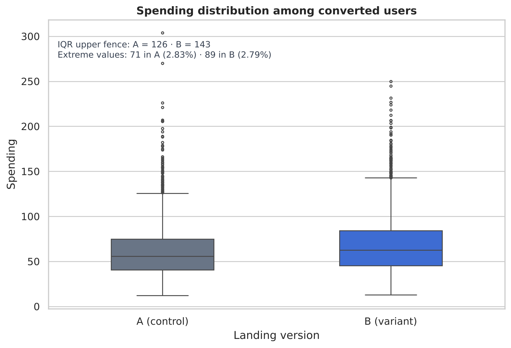
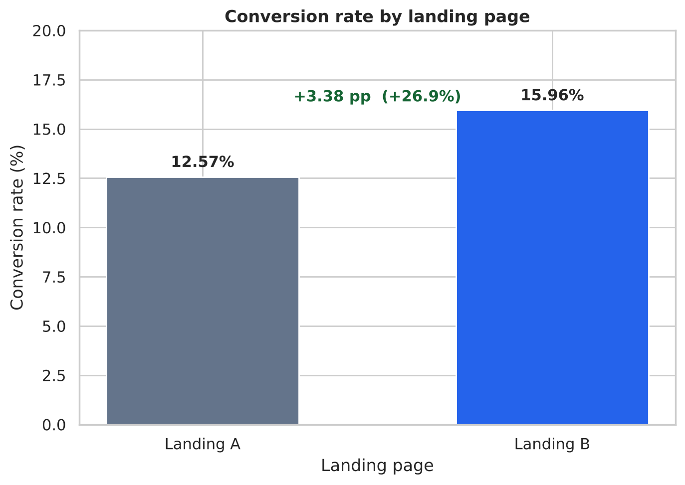
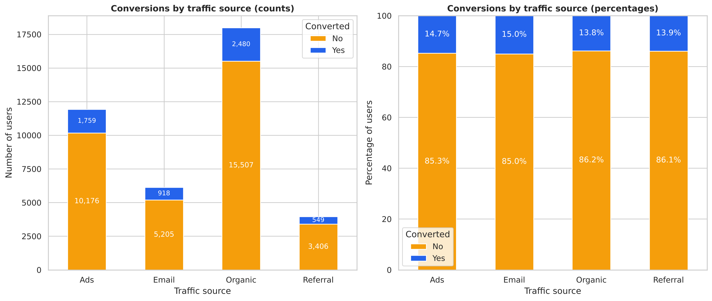
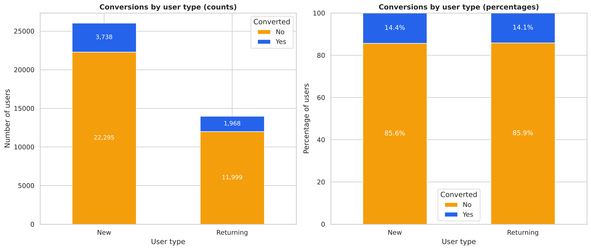

# Landing Page A/B Test — Conversion and Revenue Validation

     

## 🔍 Overview

Statistical validation of an A/B experiment run on the homepage of an e-commerce platform: 40,000 users, 28 days, two page versions, one decision. Each comparison is matched to a test its assumptions justify — Levene before the t-test, a two-proportion z-test for conversion, chi-square on contingency tables of counts for the segment questions — and every significant result is reported alongside its effect size, because at n = 40,000 statistical significance is cheap and practical relevance is not.

**Version B wins on both outcome metrics:** +26.9% conversion and +12.5% spending per converted user. The two results are not equal in weight — Cohen's d = 0.25 marks the spending gain as small, so the conversion gain is what carries the recommendation. Neither traffic source nor user type shows a practically meaningful relationship with conversion.

Tests that would strengthen the analysis but were **not** run are stated explicitly in [Next Steps](#-next-steps) rather than implied anywhere in the results.

[](https://raw.githubusercontent.com/maxsantana-data2strategy/landing-page-ab-test-analysis/main/assets/Infographic_LandingAB_EN.pdf)

---

## 🎯 Problem Statement

**Business Question:** Which version of the homepage — A (control) or B (variant) — should be implemented?

An A/B experiment was run on the homepage of an e-commerce platform, comparing two versions against conversion rate and economic value per user. The decision has to rest on statistical evidence rather than on raw differences, and has to account for behavior by traffic channel and user type.

Supporting questions:

1. Is there a significant difference in average spending per converted user between versions?
2. Which version produces the higher conversion rate?
3. Does conversion depend on traffic source?
4. Does user type (new vs returning) influence conversion?
5. How large is each difference, and is it large enough to act on?

---

## 💡 What I Did

### Section 1: Load & Validate

40,000 rows × 9 columns checked for missing values, duplicate rows and repeated user IDs — none found, so each row is an independent observation of one user. `date` converted to datetime, column names and category labels standardized to English. Group composition compared across region, device, traffic source and user type: the two arms are nearly identical in size (19,982 vs 20,018) and composition, with the largest gap at 0.8 pp (region *Oriente*). This is a **descriptive** balance check, not a formal test of the allocation — see Next Steps.

### Section 2: Average Spending per Converted User

The equality-of-variances assumption is tested first, because it decides which t-test is valid. **Levene: p = 6.9e-08** → variances differ → **Welch's t-test** (`equal_var=False`).

Result: t = −9.48, **p = 3.63e-21**, difference **+7.66 (+12.5%)**, 95% CI **[+6.08, +9.24]**, **Cohen's d = 0.25 (small)**.

### Section 2.1: Sensitivity to Extreme Values

Spending is right-skewed, so the result is checked against the extreme values before being reported. The IQR rule flags **71 purchases in A (2.83%)** and **89 in B (2.79%)** — evenly distributed, climbing smoothly to 303.68 and 249.99 with no impossible figures, no negatives and no converted user at zero. They are genuine purchases, so they are **kept**. Re-running Welch without them moves the difference from +7.66 to **+7.61** and raises Cohen's d from 0.25 to **0.30**: the tail adds variance to both groups rather than creating the effect.

### Section 3: Conversion Rate

Two-proportion z-test: z = −9.68, **p = 3.76e-22**. Absolute difference **+3.38 pp**, relative **+26.9%** — roughly 680 additional converted users per 20,000 visitors.

### Section 4: Conversion by Traffic Source

Chi-square on the contingency table of **counts**: χ² = 8.66, **p = 0.034**, dof = 3, all expected frequencies above 5. Significant — and **Cramér's V = 0.015**, which is negligible. The entire spread across the four channels is 1.2 pp.

### Section 5: Conversion by User Type

Chi-square: χ² = 0.51, **p = 0.474**, **Cramér's V = 0.004**. No association. New users convert at 14.36%, returning users at 14.09%.

### Section 6: Visualization

Absolute counts beside relative frequencies for both categorical variables, because volume and effectiveness are different things: Organic carries 45% of all traffic and converts at the lowest rate of the four channels.

---

## 🛠️ Technologies Used

| Category | Tools |
|----------|-------|
| **Python** | pandas, numpy |
| **Statistics** | `scipy.stats` — `levene`, `ttest_ind` (Welch), `chi2_contingency`; `statsmodels` — `proportions_ztest`; Cohen's d and Cramér's V computed directly |
| **Visualization** | seaborn, matplotlib |
| **Techniques** | Data-quality validation, assumption-driven test selection, hypothesis testing for means and proportions, tests of independence with expected-frequency validation, effect-size reporting (Cohen's d, Cramér's V), significance vs relevance reasoning |
| **Environment** | Jupyter Notebook |

---

## 📊 Key Findings

| Result | Test | Value | Read |
|---|---|---|---|
| Conversion rate — A vs B | Two-proportion z-test | **+3.38 pp (+26.9%)** | 12.57% → 15.96%, p = 3.8e-22 — about 680 extra converters per 20,000 visitors |
| Spending per converted user | Welch's t-test | **+7.66 (+12.5%)** | 61.09 → 68.75, p = 3.6e-21, 95% CI [+6.08, +9.24] |
| Size of the spending effect | Cohen's d | **d = 0.25** | Small — the two spending distributions overlap substantially |
| Extreme spending values | IQR rule + sensitivity re-test | **2.83% in A, 2.79% in B** | Kept — genuine purchases, evenly split; without them the difference is +7.61 and d rises to 0.30 |
| Variance assumption | Levene's test | p = 6.9e-08 | Unequal variances rule out Student's t-test and select the Welch version |
| Traffic source ↔ conversion | χ² on counts | χ² = 8.66, p = 0.034 | Significant — Email 14.99%, Ads 14.74%, Referral 13.88%, Organic 13.79% |
| Size of that association | Cramér's V | **V = 0.015** | Negligible — 1.2 pp of total spread, no basis for reallocating budget |
| User type ↔ conversion | χ² on counts + Cramér's V | p = 0.474, V = 0.004 | No association — 14.36% vs 14.09% |

### Spending spread and its extreme values



About 7% of each group's revenue sits beyond the IQR fence, in equal proportions — which is why the values are kept rather than trimmed.

### The two outcome metrics



### Volume is not effectiveness



Organic carries 45% of all traffic and converts at the lowest rate of the four channels; Email is the smallest meaningful channel and converts at the highest. The gap between them is 1.2 pp.



### Context → Findings → Implications (C→F→I)

**📍 Context:** An e-commerce platform ran a 28-day homepage experiment on 40,000 users (19,982 on A, 20,018 on B) and needed to decide whether to replace the current homepage. The dataset is complete — no nulls, no duplicates, no repeated users — and the two groups are built from comparable audiences on region, device, channel and user type.

**🔍 Findings:**

1. **B converts a quarter more visitors.** 15.96% vs 12.57% — +3.38 pp, +26.9%, z = −9.68, p = 3.8e-22. This is the larger of the two effects
2. **B's converters also spend more, modestly.** 68.75 vs 61.09 — +12.5%, 95% CI [+6.08, +9.24], but Cohen's d = 0.25: a real shift inside two heavily overlapping distributions, not a different class of customer
3. **The result does not rest on a few large purchases.** 2.8% of buyers in each version sit beyond the IQR fence and carry ~7% of revenue; removing them leaves the difference at +7.61 and raises d to 0.30
4. **The variance check changed the test.** Levene's p = 6.9e-08 ruled out Student's t-test; reporting the Welch version is what makes the spending result defensible
5. **Channel is statistically associated with conversion and practically irrelevant.** χ² = 8.66, p = 0.034, but Cramér's V = 0.015 and the whole spread is 1.2 pp
6. **User type shows nothing at all.** 14.36% vs 14.09%, p = 0.474, V = 0.004 — compatible with random variation
7. **Volume and effectiveness diverge.** Organic is the largest channel by far and the weakest converter; the difference is too small to act on, but it is the opposite of what a volume-led reading would assume

**💡 Implications:**

- ✅ **Implement Landing Page B.** Both outcome metrics favour it, and the conversion difference is large enough to matter commercially
- 🎯 **Treat the conversion gain as the prize, not the spending gain.** +26.9% relative on conversion is worth considerably more than a +12.5% difference with d = 0.25
- ⚠️ **Do not reallocate budget by channel on this evidence.** The association is significant only because n = 40,000; 1.2 pp of spread and V = 0.015 cannot carry a budget decision
- 🔄 **Do not segment the roll-out by user type.** No association with conversion, and nothing here that distinguishes new from returning visitors
- 📋 **Validate the allocation formally before rolling out.** The balance check in Section 1 is descriptive; the tests listed below are what would close that gap
- 📊 **Track the guardrails this analysis cannot see:** refund and return rate, support contacts per order, acquisition cost by channel

---

## 🚀 How to Use

This repository is **fully reproducible**: the raw dataset is committed alongside the notebook.

```
landing-page-ab-test-analysis/
├── Landing_Page_AB_Test_Analysis.ipynb
├── landing_experiment.csv
├── assets/
│   ├── Infographic_LandingAB_EN.jpg
│   ├── Infographic_LandingAB_EN.pdf
│   ├── figure_1_spending_outliers.png
│   ├── figure_2_conversion_rate_by_version.png
│   ├── figure_3_conversion_by_traffic_source.png
│   └── figure_4_conversion_by_user_type.png
├── LICENSE
└── README.md
```

1. **Read without running** — every cell in the notebook retains its executed output, so the full analysis is readable as-is on GitHub
2. **Run it yourself** — clone the repository and launch the notebook from its root; the `read_csv` call uses a relative path, so no configuration is needed:

   ```bash
   git clone https://github.com/maxsantana-data2strategy/landing-page-ab-test-analysis.git
   cd landing-page-ab-test-analysis
   pip install pandas numpy scipy statsmodels seaborn matplotlib jupyter
   jupyter notebook Landing_Page_AB_Test_Analysis.ipynb
   ```

3. **Reuse the figures** — all plots are exported to `assets/` for reports and presentations
4. **Point it at other experiments** — the notebook runs against any table carrying the nine columns below

### Dataset schema

| Column | Type | Description |
|---|---|---|
| `user_id` | UUID | Unique user identifier |
| `date` | date | Date the user was exposed to the page |
| `landing` | categorical | Page version shown — A (control) or B (variant) |
| `region` | categorical | Norte, Centro, Sur, Occidente, Oriente |
| `dispositivo` | categorical | Mobile, Desktop — renamed to `device` in the notebook |
| `traffic_source` | categorical | Organic, Ads, Email, Referral |
| `user_type` | categorical | Nuevo, Recurrente — relabelled New / Returning in the notebook |
| `converted` | binary | 1 if the user converted, 0 otherwise |
| `gasto` | float | Amount spent (0 when `converted` = 0) — renamed to `spending` in the notebook |

**Unit of analysis:** one row per user, each exposed to exactly one page version.

---

## ⚖️ Limitations

- **The allocation was not formally validated.** Section 1 compares group composition descriptively; it does not test the 50/50 split or the covariate balance statistically
- **Normality was not tested.** Levene's test covers variances; the distributional assumption behind the t-test was not checked, and spending is visibly right-skewed
- **The conversion difference has no interval.** Section 3 reports a point estimate and a p-value where the spending comparison reports a confidence interval
- **Segment effects were tested, interaction was not.** Sections 4 and 5 ask whether segments differ in conversion, not whether B's advantage differs by segment — a different question that needs a different test
- **Significance is cheap at n = 40,000.** The channel association (p = 0.034) is the clearest case: statistically detectable, practically worthless. Effect sizes are reported alongside every significant result for exactly this reason
- **The upper tail was not analyzed as a segment.** Extreme purchases were reviewed and retained, but whether one version attracts a different *composition* of large buyers was not examined
- **The experiment shows that B works, not why.** No element-level test isolates copy, layout, call-to-action or imagery
- **Novelty is not ruled out.** A 28-day window cannot distinguish a durable improvement from a temporary reaction to an unfamiliar page
- **Downstream economics are unmeasured.** Refunds, returns, support load and acquisition cost fall outside the dataset
- **External validity is limited.** One platform, one 28-day window, one visitor mix; seasonality and campaign calendar are not controlled for

## 🧭 Next Steps

The analyses below were **not performed here**. Each closes a specific gap the current evidence leaves open, and Section 8 of the notebook states the reasoning for each one.

**Validate the experiment**

1. **Sample ratio mismatch (SRM)** — χ² goodness of fit on the A/B split. If assignment was not random, every comparison is confounded
2. **Covariate balance tests** — χ² on region, device, channel and user type by version, replacing the descriptive check with a formal one
3. **Cross-exposure and data-rule checks** — whether any user appears in both versions, and whether `gasto` > 0 holds only when `converted` = 1

**Strengthen the comparisons made**

4. **Shapiro-Wilk** on spending, to test the normality assumption the t-test rests on
5. **Mann-Whitney U** on spending, a rank-based test that would confirm the skew did not drive the Welch result
6. **Confidence interval for the difference in conversion proportions**, so the larger effect is reported with the same rigour as the smaller one

**Answer what this analysis could not**

7. **Upper-tail analysis of spending** — about 7% of revenue sits with the 2.8% of buyers beyond the IQR fence. Their proportions match between versions, but the composition of that tail, and whether B's advantage holds inside it, was not examined
8. **Breslow-Day test of homogeneity of odds ratios** — is B's advantage the same size in every channel and for both user types? This is what would justify a uniform roll-out rather than a segmented one
9. **Per-segment comparisons with Holm correction** — which segments show a real lift once multiple testing is accounted for
10. **Bootstrap on revenue per exposed user** (total spending ÷ users exposed) — the metric that combines conversion and spending into the number the decision ultimately rests on. Roughly 86% of its values are zero, so a resampling interval is more appropriate than a parametric one

**Beyond statistics**

11. **Post-launch holdout** (5–10% on A for 4–8 weeks) to separate a durable gain from a novelty effect
12. **Guardrail metrics** — refund rate, support contacts per order, acquisition cost by channel
13. **Element-level follow-up tests** — copy, layout, call-to-action, imagery

---

## 📚 Learnings & Best Practices

- **Let the assumptions pick the test.** Levene's p = 6.9e-08 is what makes Welch's t-test the right call rather than Student's. Running the test first and checking the assumption afterwards gets the same number with none of the standing
- **χ² takes counts, not percentages.** Running `chi2_contingency` on a table normalized to percentages returns χ² = 0.089, p = 0.993 for the channel association instead of χ² = 8.66, p = 0.034 — an apparently decisive "no association" that is purely an artifact of the table total being 400 instead of 40,000
- **Report the effect size next to every significant result.** "p = 3.6e-21" says nothing a decision can use; "+7.66, 95% CI [+6.08, +9.24], d = 0.25" says the effect is real, bounded and small
- **Significance and relevance are different questions.** At n = 40,000 a 1.2 pp spread across channels clears any threshold. Cramér's V is what keeps that from becoming a budget reallocation
- **Decide outliers with evidence, not reflex.** Trimming the tail because it is a tail discards real revenue. The questions that settle it are whether the values are errors, whether they fall unevenly between groups, and whether the conclusion moves without them — here the answers were no, no and no
- **Rank the findings instead of listing them.** Two significant results with different effect sizes are not two equal findings — saying which one carries the decision is the analyst's job, not the reader's
- **State what was not tested.** Writing the missing analyses next to the conclusions is what makes the conclusions usable: a reader knows exactly how far the evidence reaches and where it stops

---

**Author:** Max Santana — Data Analyst, Business Intelligence & Strategic Foresight · [GitHub](https://github.com/maxsantana-data2strategy) · [Portfolio](https://maxsantana-data2strategy.github.io)

**Status:** ✅ Complete | **Data Quality:** ✅ Validated (40,000 users, zero nulls, no duplicates, no repeated users) | **Ready for Decisions:** ✅ Yes, with the stated validation and guardrail caveats
